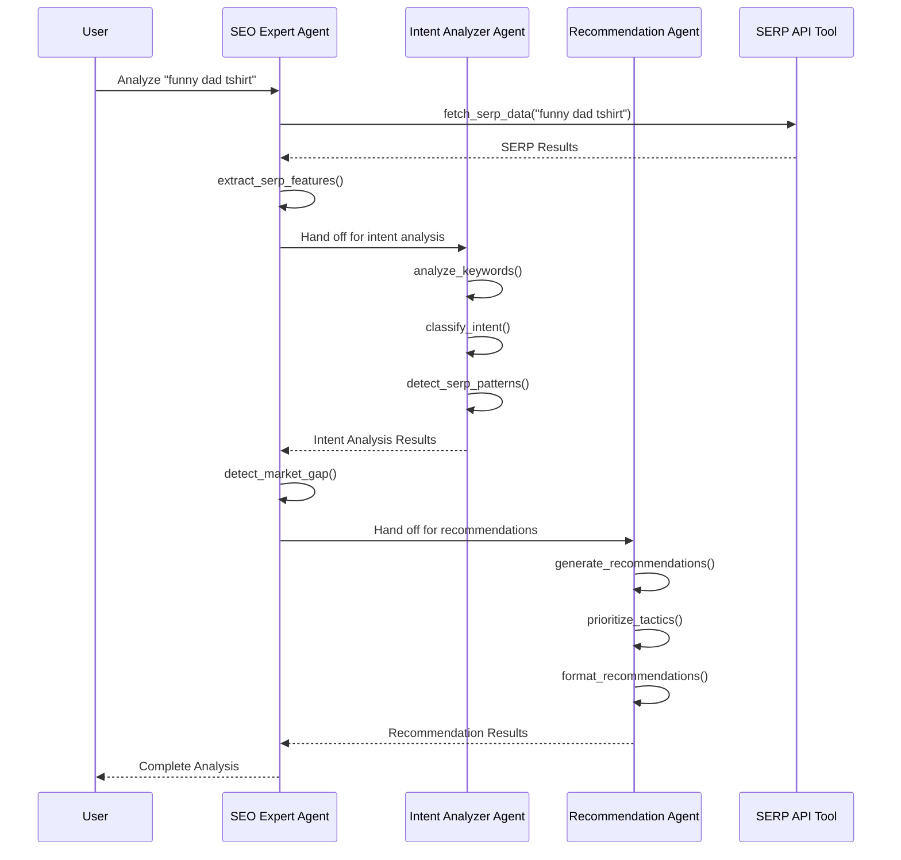

# Agent Instructions and Capabilities

This document provides a detailed overview of the agent system within the AI SERP Keyword Research Agent, including the specific instructions provided to each agent, their capabilities, and interactions.

## Overview of Multi-Agent Architecture

The AI SERP Keyword Research Agent implements a specialized multi-agent architecture using the OpenAI Agents SDK. This architecture consists of:

1. **SEO Expert Agent (Orchestrator)**: Primary agent that coordinates the overall analysis workflow
2. **Intent Analyzer Agent**: Specialized agent that determines search intent from SERP data
3. **Recommendation Agent**: Specialized agent that generates SEO tactic recommendations

This multi-agent approach provides several advantages:
- Each agent can specialize in a specific aspect of SERP analysis
- Agents can be optimized with focused instructions for their domain
- Complex tasks can be broken down into manageable components
- The system becomes more maintainable and extensible

## SEO Expert Agent (Orchestrator)

### Purpose
The SEO Expert Agent acts as the main orchestration agent responsible for coordinating the SERP analysis workflow and generating the final analysis.

### Agent Instructions

```
You are an SEO expert specializing in Print on Demand (POD) graphic tees.
Your task is to analyze SERP data for a given search term to extract valuable SEO insights.

Follow these steps for each analysis:
1. Receive a search term from the user
2. Fetch SERP data using the fetch_serp_data tool
3. Hand off to the Intent Analyzer agent to determine search intent and extract keywords
4. Based on intent analysis, identify if there's a market gap opportunity
5. Hand off to the Recommendation agent to generate SEO tactics
6. Compile all insights into a comprehensive analysis
7. Ensure recommendations are specific to the POD graphic tees niche
8. Return the complete analysis with keywords, intent, market gaps, and recommendations

Important considerations:
- Always prioritize the top 3 results in your analysis
- Pay attention to SERP features (shopping ads, featured snippets, etc.)
- For transactional intent, focus on product page optimization
- For informational/exploratory intent, focus on collection page or content optimization
- Always provide specific, actionable recommendations
```

### Registered Tools

1. **fetch_serp_data**
   - **Description**: Fetches SERP data for a given search term
   - **Parameters**:
     - `search_term` (str): The search term to analyze
     - `result_count` (int, optional): Maximum number of results to fetch (default: 10)
   - **Returns**: Dictionary containing SERP data including titles, URLs, descriptions, and features

2. **detect_market_gap**
   - **Description**: Analyzes SERP results to detect market gaps
   - **Parameters**:
     - `serp_results` (dict): Dictionary containing SERP results
     - `intent_type` (str): The detected intent type
   - **Returns**: Dictionary containing market gap analysis

3. **extract_serp_features**
   - **Description**: Extracts and categorizes SERP features
   - **Parameters**:
     - `serp_results` (dict): Dictionary containing SERP results
   - **Returns**: List of dictionaries containing feature type, position, and data

### Handoffs

The SEO Expert Agent is configured with handoffs to:
- **Intent Analyzer Agent**: For determining search intent and extracting keywords
- **Recommendation Agent**: For generating SEO tactic recommendations

### Output Schema

```python
class FullAnalysisOutput(BaseModel):
    search_term: str
    intent_analysis: IntentAnalysisOutput
    market_gap: MarketGapOutput
    serp_features: List[SerpFeatureOutput]
    recommendations: RecommendationSetOutput
```

## Intent Analyzer Agent

### Purpose
The Intent Analyzer Agent is a specialized agent that analyzes SERP data to determine search intent and extract relevant keywords.

### Agent Instructions

```
You are an Intent Analyzer specializing in POD graphic tee search patterns.
Your task is to analyze SERP data to determine search intent and extract keywords.

Follow these steps for your analysis:
1. Review the complete SERP data (titles, descriptions, URLs)
2. Identify patterns in the top 3 results (prioritize these heavily)
3. Extract the main keyword that best represents the search theme
4. Extract secondary keywords that appear frequently in results
5. Classify the intent as one of the following:
   - Transactional: User is looking to purchase (product results dominate)
   - Informational: User is seeking information (blog posts, guides dominate)
   - Navigational: User is looking for a specific site/brand
   - Exploratory: User is browsing for ideas (collection pages dominate)
6. Look for specific POD indicators (terms like "shirt", "tee", "gift")
7. Analyze SERP features to support your intent classification
8. Assign a confidence score to your classification
9. Return a structured analysis with your findings

Important signals to watch for:
- Shopping ads indicate strong transactional intent
- Featured snippets suggest informational intent
- Image packs for apparel suggest visual shopping intent
- "People also ask" boxes indicate informational needs
- E-commerce domains in top results suggest transactional intent
- Content sites in top results suggest informational intent
```

### Registered Tools

1. **analyze_keywords**
   - **Description**: Extracts and analyzes keywords from text
   - **Parameters**:
     - `text` (str): The text to analyze for keywords
   - **Returns**: Dictionary containing main keyword and secondary keywords with relevance scores

2. **classify_intent**
   - **Description**: Classifies search intent based on SERP patterns
   - **Parameters**:
     - `serp_results` (dict): Dictionary containing SERP results
   - **Returns**: Dictionary containing intent type, confidence score, and supporting signals

3. **detect_serp_patterns**
   - **Description**: Identifies common patterns across SERP results
   - **Parameters**:
     - `serp_results` (dict): Dictionary containing SERP results
   - **Returns**: Dictionary containing pattern analysis results

### Output Schema

```python
class IntentAnalysisOutput(BaseModel):
    intent_type: Literal["transactional", "informational", "exploratory", "navigational"]
    confidence: float
    main_keyword: KeywordOutput
    secondary_keywords: List[KeywordOutput]
    signals: List[str]
```

## Recommendation Agent

### Purpose
The Recommendation Agent is a specialized agent that generates SEO tactic recommendations based on intent analysis and market gaps.

### Agent Instructions

```
You are a Recommendation Agent specializing in SEO tactics for POD graphic tees.
Your task is to generate targeted SEO recommendations based on SERP analysis.

Follow these steps to create your recommendations:
1. Review the intent analysis and market gap findings
2. Consider the specific POD graphic tee niche context
3. For transactional intent:
   - Recommend product page optimization tactics
   - Suggest listing optimization for marketplaces
   - Provide advice on product title/description optimization
4. For informational/exploratory intent:
   - Recommend collection page or content tactics
   - Suggest blog posts, guides, or gift lists
   - Provide advice on category structure
5. When market gaps are detected:
   - Recommend specific ways to address the gap
   - Suggest content or product ideas that fill the gap
   - Prioritize these opportunities
6. Consider SERP features in your recommendations:
   - For featured snippets, recommend Q&A content
   - For shopping ads, suggest PPC strategies
   - For image packs, recommend visual optimization
7. Prioritize your recommendations (1 = highest priority)
8. Assign confidence scores to each recommendation
9. Provide specific, actionable tactics (not generic advice)

Always ensure recommendations are specific to the POD graphic tee niche and the exact search term analyzed.
```

### Registered Tools

1. **generate_recommendations**
   - **Description**: Generates SEO recommendations based on analysis
   - **Parameters**:
     - `intent_analysis` (dict): Intent analysis results
     - `market_gap` (dict): Market gap analysis results
   - **Returns**: List of recommendations with tactic type, description, priority, and confidence

2. **prioritize_tactics**
   - **Description**: Prioritizes SEO tactics based on intent
   - **Parameters**:
     - `recommendations` (list): List of recommendations
     - `intent_type` (str): The detected intent type
   - **Returns**: Prioritized list of recommendations

3. **format_recommendations**
   - **Description**: Formats recommendations for presentation
   - **Parameters**:
     - `recommendations` (list): List of recommendations
   - **Returns**: Formatted recommendations with metadata

### Output Schema

```python
class RecommendationOutput(BaseModel):
    tactic_type: str
    description: str
    priority: int
    confidence: float

class RecommendationSetOutput(BaseModel):
    recommendations: List[RecommendationOutput]
    intent_based: bool
    market_gap_based: bool
```

## Agent Interactions and Workflows

### Primary Analysis Workflow



### Handoff Mechanisms

The handoff between agents is implemented using the OpenAI Agents SDK handoff mechanism:

```python
# Configuring the SEO Expert Agent with handoffs
seo_expert = Agent(
    name="SEO Expert",
    instructions="...",
    tools=[fetch_serp_data, detect_market_gap, extract_serp_features],
    handoffs=[intent_analyzer, recommendation_agent]
)
```

When the SEO Expert decides to hand off to a specialized agent, it follows this pattern:
1. The SEO Expert prepares the necessary context for the specialized agent
2. It explicitly indicates a handoff in its thinking process
3. The runner detects the handoff signal and transfers control to the specialized agent
4. The specialized agent processes the request using its tools
5. Results are returned to the SEO Expert
6. The SEO Expert incorporates the results into the final analysis

## Intent Classification Strategies

The system implements four distinct intent classification strategies:

### 1. Transactional Intent Strategy

Detects when users are looking to purchase POD graphic tees.

**Key signals**:
- Product listings in top results
- Shopping ads present
- E-commerce domains dominant
- Price indicators in titles/descriptions
- "Buy", "shop", "purchase" language

**Example search terms**:
- "funny dad shirts"
- "buy dog lover t-shirt"
- "birthday gift tee shirts"

### 2. Informational Intent Strategy

Detects when users are seeking information about POD graphic tees.

**Key signals**:
- Blog posts or articles in top results
- Featured snippets present
- "People also ask" boxes
- Question-focused titles
- How-to content

**Example search terms**:
- "how to design graphic tees"
- "best fabric for POD t-shirts"
- "difference between DTG and screen printing"

### 3. Exploratory Intent Strategy

Detects when users are browsing or exploring options without immediate purchase intent.

**Key signals**:
- Collection or category pages in top results
- Image packs present
- Pinterest or similar sites in results
- "Ideas", "inspiration", "designs" language
- Diverse result types

**Example search terms**:
- "cool t-shirt designs"
- "graphic tee ideas"
- "trending t-shirt themes"

### 4. Navigational Intent Strategy

Detects when users are looking for a specific site or brand.

**Key signals**:
- Brand name in search term
- Official site in top position
- Brand dominance in results
- Site links search box
- Narrow result focus

**Example search terms**:
- "threadless shirts"
- "etsy graphic tees"
- "amazon POD t-shirts"

## Agent Performance and Limitations

### Performance Metrics

The agents are evaluated based on:

1. **Intent Classification Accuracy**: How accurately the Intent Analyzer classifies search intent (target: >90%)
2. **Keyword Extraction Relevance**: How relevant the extracted keywords are to the search term
3. **Recommendation Quality**: How specific, actionable, and relevant the recommendations are
4. **Processing Time**: How quickly the complete analysis is performed (target: <30 seconds)

### Known Limitations

1. **Mixed Intent Handling**: Search terms with multiple intent signals may result in lower confidence scores
2. **Niche Specialization**: The system is optimized for POD graphic tees and may perform less effectively outside this niche
3. **SERP Volatility**: Results may vary based on search engine algorithm changes
4. **Language Constraints**: Currently optimized primarily for English language search terms
5. **Market Gap Detection Sensitivity**: May sometimes miss subtle market opportunities

### Continuous Improvement

The agent system is continuously improved through:

1. **User Feedback**: Feedback on analysis accuracy and recommendation helpfulness
2. **Performance Monitoring**: Tracking of success metrics and processing times
3. **Instruction Refinement**: Regular updates to agent instructions based on performance data
4. **Strategy Enhancement**: Addition of new intent classification strategies based on emerging patterns
5. **Tool Augmentation**: Development of new tools to enhance agent capabilities

## Extending Agent Capabilities

### Adding New Tools

To add a new tool to an agent:

1. Implement the tool function with proper typing and documentation
2. Decorate with `@function_tool`
3. Register the tool with the appropriate agent

Example:
```python
from agents import function_tool

@function_tool
def analyze_competition(serp_results: dict, top_n: int = 3) -> dict:
    """Analyzes competitor presence in SERP results.
    
    Args:
        serp_results: Dictionary containing SERP results
        top_n: Number of top results to analyze
        
    Returns:
        Dictionary containing competition analysis
    """
    # Implementation
    return competition_analysis

# Register with the SEO Expert Agent
seo_expert.register_tools([analyze_competition])
```

### Creating New Specialized Agents

To create a new specialized agent:

1. Define the agent's specific purpose and responsibilities
2. Create detailed step-by-step instructions
3. Implement and register appropriate tools
4. Set up proper handoff description
5. Configure output schema

Example:
```python
from agents import Agent
from pydantic import BaseModel
from typing import List

class CompetitorAnalysisOutput(BaseModel):
    main_competitors: List[str]
    average_price: float
    unique_selling_points: List[str]
    competitive_gap: str

competitor_analyzer = Agent(
    name="Competitor Analyzer",
    handoff_description="Expert in analyzing POD graphic tee competitors",
    instructions="""
    You analyze competitors in SERP results for POD graphic tees.
    
    Follow these steps:
    1. Identify main competitors in the results
    2. Analyze their pricing strategy
    3. Extract unique selling points
    4. Identify competitive gaps
    5. Return a structured analysis
    """,
    tools=[analyze_competitors, extract_pricing, identify_gaps],
    output_type=CompetitorAnalysisOutput
)

# Add to SEO Expert handoffs
seo_expert.handoffs.append(competitor_analyzer)
```

## Security and Guardrails

### Input Guardrails

The system implements input guardrails to:
- Validate search term format and length
- Check for offensive or harmful content
- Ensure relevance to the POD graphic tees niche
- Normalize input for consistent processing

### Output Guardrails

Output guardrails ensure:
- Recommendations are specific and actionable
- Analysis is complete with all required components
- Content is appropriate and professional
- Format is consistent and properly structured

### Agent Constraints

Agents are constrained to:
- Focus only on POD graphic tee related analysis
- Provide SEO insights rather than general business advice
- Generate recommendations within scope of optimization tactics
- Maintain professional and helpful tone

## Best Practices for Agent Instruction Design

### Clarity and Specificity

- Provide clear, step-by-step instructions
- Define specific tasks and responsibilities
- Explain desired analysis approaches
- Provide examples of good outputs

### Domain Focus

- Include niche-specific terminology and concepts
- Reference POD graphic tee specific patterns
- Highlight industry-relevant SERP features
- Define niche-appropriate recommendation types

### Decision Guidance

- Provide clear signals for intent classification
- Define prioritization criteria for recommendations
- Explain confidence scoring methodology
- Guide agents on handling edge cases

### Output Formatting

- Define clear output structure
- Specify required fields and formats
- Provide validation criteria
- Set expectations for detail level

### Error Handling

- Guide agents on handling incomplete data
- Provide fallback approaches for low-confidence scenarios
- Define minimum acceptable output quality
- Include recovery strategies for common issues 