# Architecture Diagrams

This document provides visual representations of the AI SERP Keyword Research Agent architecture, showcasing its components, interactions, and data flows.

## System Overview

The following diagram illustrates the high-level architecture of the AI SERP Keyword Research Agent:

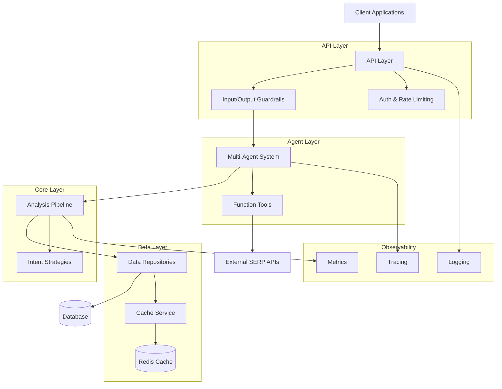

## Multi-Agent Architecture

The system uses a specialized multi-agent architecture with distinct responsibilities:

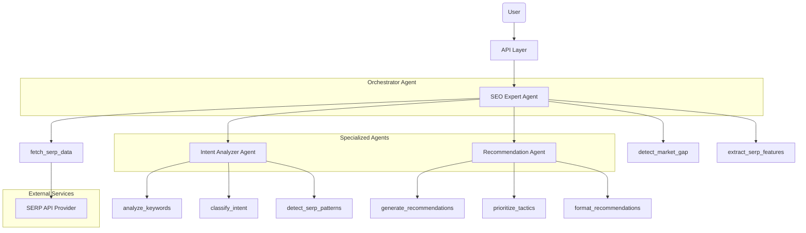

## Data Flow Diagram

This diagram illustrates how data flows through the system during a keyword analysis:

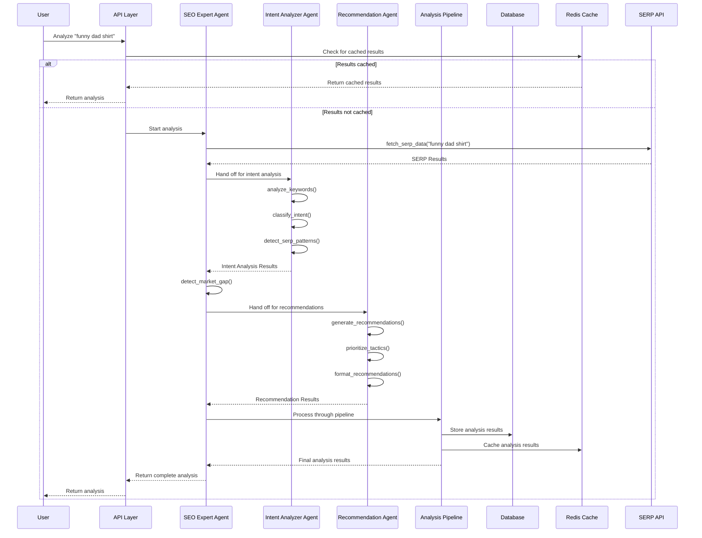

## Pipeline Architecture

The analysis pipeline processes search terms through a series of stages:

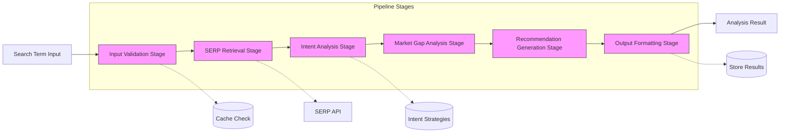

## Intent Classification Strategies

This diagram shows the strategy pattern implementation for intent classification:

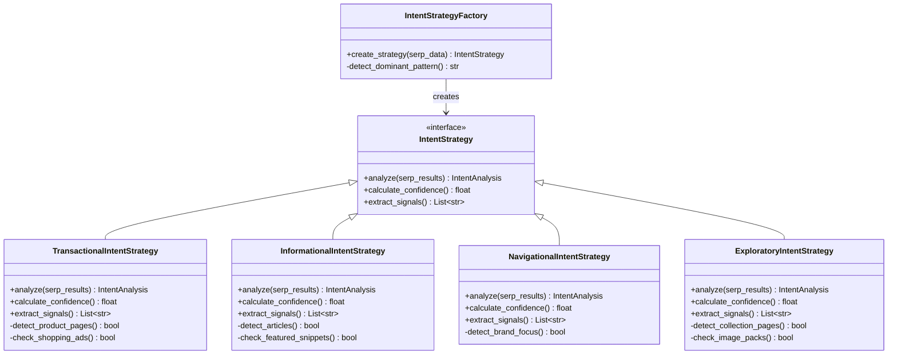

## Deployment Architecture

This diagram illustrates the production deployment architecture using Kubernetes:

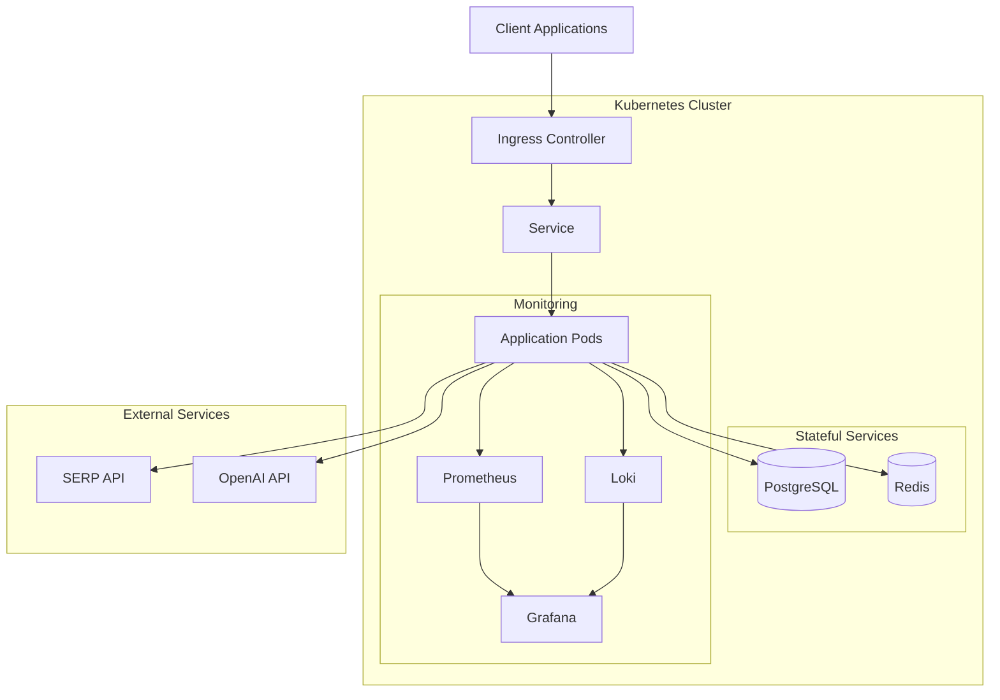

## Component Hierarchy

The following diagram shows the hierarchical structure of the application components:

```mermaid
graph TD
    App[AI SERP Keyword Research Agent] --> APILayer[API Layer]
    App --> AgentLayer[Agent Layer]
    App --> CoreLayer[Core Layer]
    App --> DataLayer[Data Layer]
    App --> ObservabilityLayer[Observability Layer]
    
    APILayer --> APIRoutes[API Routes]
    APILayer --> APIMiddleware[API Middleware]
    APILayer --> APISchemas[Request/Response Schemas]
    
    AgentLayer --> SEOAgent[SEO Expert Agent]
    AgentLayer --> IntentAgent[Intent Analyzer Agent]
    AgentLayer --> RecommendationAgent[Recommendation Agent]
    AgentLayer --> FunctionTools[Function Tools]
    
    CoreLayer --> Pipeline[Analysis Pipeline]
    CoreLayer --> IntentStrategies[Intent Strategies]
    CoreLayer --> DomainModels[Domain Models]
    CoreLayer --> SERPProcessing[SERP Processing]
    
    DataLayer --> Repositories[Repositories]
    DataLayer --> DataModels[Data Models]
    DataLayer --> CacheService[Cache Service]
    DataLayer --> Migrations[Database Migrations]
    
    ObservabilityLayer --> Tracing[Tracing]
    ObservabilityLayer --> Metrics[Metrics]
    ObservabilityLayer --> Logging[Logging]
```

## Database Schema

This diagram visualizes the database schema and relationships:

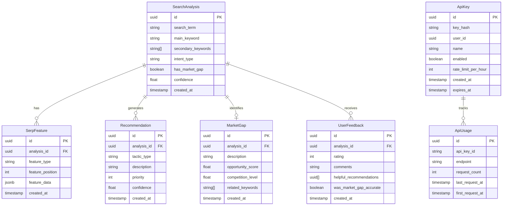

## API Structure

This diagram outlines the structure of the API endpoints:

```mermaid
graph TD
    API[API] --> V1[/api/v1]
    API --> Health[/health]
    API --> Docs[/docs]
    API --> Redoc[/redoc]
    
    V1 --> Analyze[/analyze]
    V1 --> Feedback[/feedback]
    
    subgraph "Authentication"
        Auth[API Key Auth]
        RateLimit[Rate Limiting]
        Analyze --> Auth
        Analyze --> RateLimit
        Feedback --> Auth
        Feedback --> RateLimit
    end
    
    subgraph "Request Processing"
        Validation[Input Validation]
        Sanitization[Input Sanitization]
        Analyze --> Validation
        Analyze --> Sanitization
        Feedback --> Validation
        Feedback --> Sanitization
    end
    
    Analyze --> AnalyzeLogic[Analysis Pipeline]
    Feedback --> FeedbackLogic[Feedback Storage]
    
    style API fill:#f9f,stroke:#333,stroke-width:2px
    style Analyze fill:#bbf,stroke:#333,stroke-width:2px
    style Feedback fill:#bbf,stroke:#333,stroke-width:2px
    style Health fill:#bfb,stroke:#333,stroke-width:1px
```

## Observability Architecture

This diagram shows how tracing, metrics, and logging are implemented:

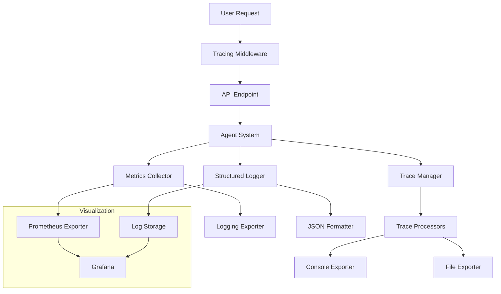

## Guardrails Implementation

This diagram illustrates the guardrails implementation:

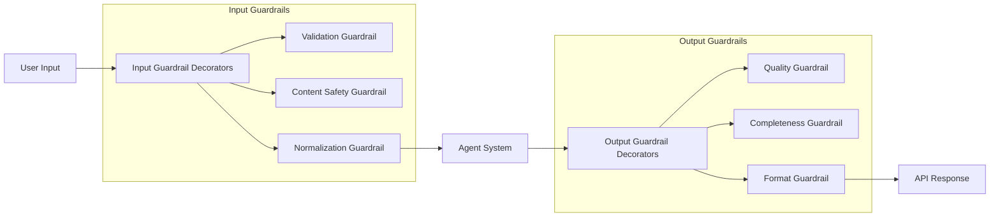

## Sequence Diagram: API Request

This diagram shows the sequence of operations when an API request is received:

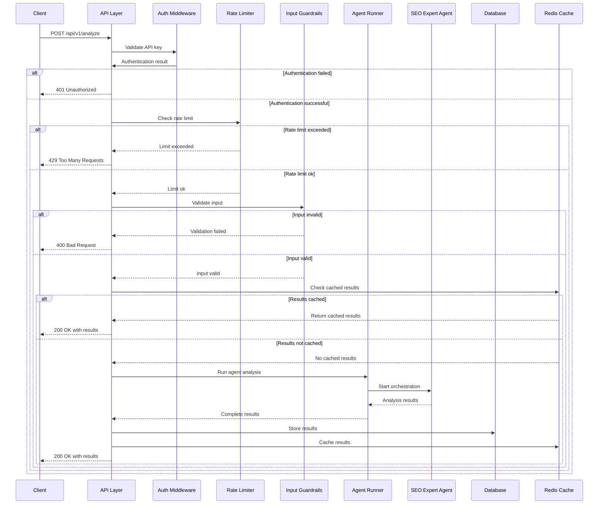

## Agent Interaction Diagram

This diagram illustrates how agents interact during analysis:

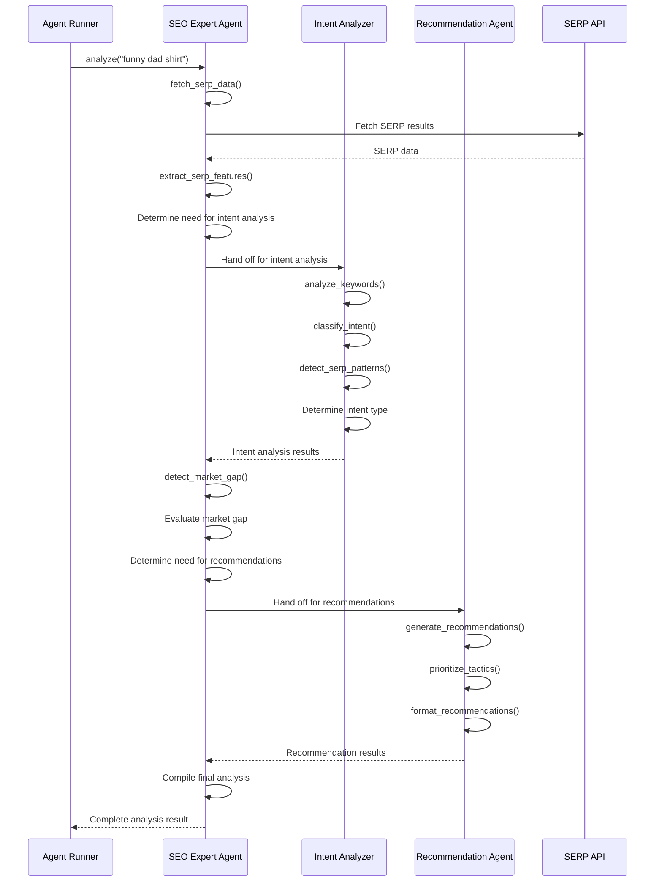

## Tech Stack Overview

This diagram provides an overview of the technology stack used:

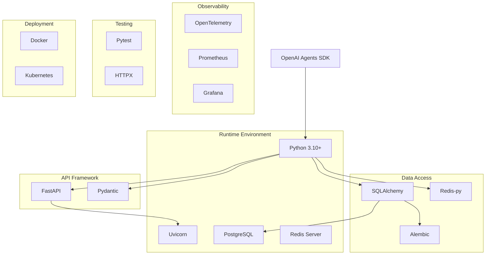