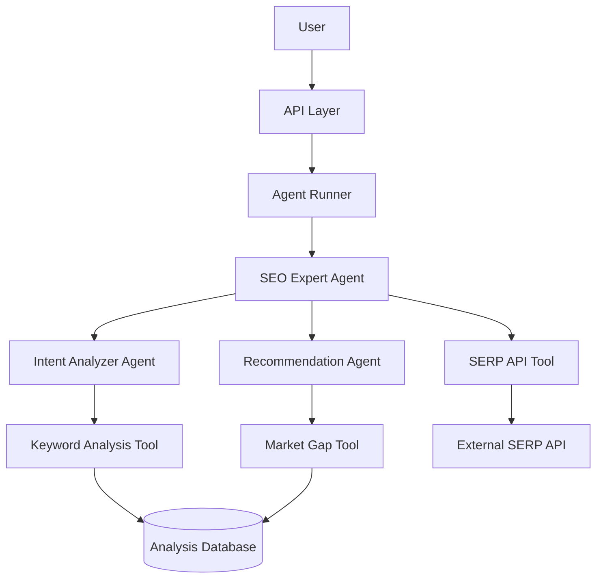

# Technical Design Document: AI SERP Keyword Research Agent for POD Graphic Tees

## 1. Introduction

### 1.1 Purpose
This document provides a detailed technical design for AI SERP Keyword Research Agent, a system that leverages the OpenAI Agents SDK to analyze Google Search Engine Results Pages (SERPs) for keyword research in the Print on Demand (POD) graphic tees niche.

### 1.2 Scope
The system will analyze SERP data for user-provided search terms, extract main and secondary keywords, identify search intent, detect market gaps, and recommend SEO tactics tailored to the Print on Demand graphic tees niche. The scope includes agent orchestration, SERP data retrieval, intent analysis, and recommendation generation, but excludes full-stack web UI development and bulk keyword research capabilities.

### 1.3 System Overview
The system uses a modular architecture built around specialized AI agents for SEO analysis, intent detection, and recommendation generation, with supporting infrastructure for SERP data retrieval, keyword extraction, and market gap analysis.

### 1.4 OpenAI Agents SDK Integration
The system is built on the OpenAI Agents SDK framework, leveraging its core capabilities:
- **Agent Orchestration**: Multi-agent architecture with a main SEO expert agent coordinating with specialized intent analysis and recommendation agents, using both LLM-driven and code-driven orchestration patterns
- **Function Tools**: Custom tools for SERP API integration, keyword analysis, and market gap detection with proper error handling and retry mechanisms
- **Knowledge Sources**: Domain-specific knowledge about SEO patterns, transactional vs. exploratory intent, SERP feature analysis, and POD niche-specific patterns
- **Agent Instructions**: Clear, step-by-step instructions for each agent with specific analysis workflows and evaluation criteria
- **Structured Outputs**: Pydantic models for input/output validation and consistent data structures across the system
- **Observability**: Comprehensive tracing and logging of agent interactions, API calls, and system performance

This architecture enables sophisticated SERP analysis through multi-agent collaboration, with each agent focused on a specific aspect of the process: orchestration, intent analysis, and recommendation generation.

## 2. System Architecture

### 2.1 High-Level Architecture



### 2.2 Component Architecture

#### 2.2.1 Agent Layer
The system implements a multi-agent architecture using the OpenAI Agents SDK, following its design patterns for agent creation, tool registration, knowledge integration, and orchestration:

- **Main Orchestration Agent (SEO Expert)**: Coordinates the overall analysis workflow and aggregates results
  - Implemented using OpenAI Agents SDK's Agent class
  - Responsible for delegating specialized tasks to other agents
  - Makes high-level decisions about search intent classification
  - Handles error recovery and fallbacks when specialized agents fail

- **Intent Analyzer Agent**: Specialized in determining search intent from SERP data
  - Analyzes SERP features and content patterns to classify intent
  - Uses specialized knowledge of transactional vs. exploratory patterns
  - Extracts main and secondary keywords from SERP results
  - Provides intent classification with confidence scores

- **Recommendation Agent**: Generates SEO tactic recommendations based on analysis
  - Recommends specific SEO approaches based on intent and market gaps
  - Considers SERP features like featured snippets, shopping ads, etc.
  - Tailors recommendations specifically to POD graphic tees niche
  - Provides actionable, prioritized recommendations

Each agent follows the OpenAI Agents SDK pattern:
```python
# Example of agent implementation with OpenAI Agents SDK
from agents import Agent, function_tool, Runner, RunConfig
from pydantic import BaseModel
from typing import List, Dict, Any, Optional

# Define structured output model
class IntentAnalysis(BaseModel):
    main_keyword: str
    secondary_keywords: List[str]
    intent_type: str
    confidence: float
    serp_features: List[str]

# Define function tool
@function_tool
async def analyze_serp_data(serp_results: Dict[str, Any], max_results: int = 10) -> Dict[str, Any]:
    """Analyzes SERP data to determine search intent and extract keywords.
    
    Args:
        serp_results: The SERP data to analyze
        max_results: Maximum number of results to consider
        
    Returns:
        Dictionary containing intent analysis results
    """
    try:
        # Implementation with proper analysis logic
        return {
            "main_keyword": "dad graphic tee",
            "secondary_keywords": ["funny dad shirt", "father's day gift"],
            "intent_type": "transactional",
            "confidence": 0.87,
            "serp_features": ["shopping_ads", "image_pack"]
        }
    except Exception as e:
        raise ValueError(f"SERP analysis failed: {str(e)}")

# Create the agent with tools
intent_analyzer = Agent(
    name="Intent Analyzer",
    instructions="""
    You analyze SERP data to determine search intent and extract keywords.
    
    Follow these steps:
    1. Review the SERP titles, descriptions, and URLs
    2. Identify the main keyword theme across top results
    3. Extract secondary keywords that appear frequently
    4. Classify intent as transactional, informational, or navigational
    5. Pay special attention to SERP features (shopping ads, featured snippets)
    6. Assess your confidence in the intent classification
    """,
    tools=[analyze_serp_data],
    output_type=IntentAnalysis
)
```

#### 2.2.2 Core Layer
- **Pipeline Manager**: Orchestrates the flow of data through analysis stages
- **Intent Analysis Module**: Core logic for determining search intent from SERP data
- **Keyword Extraction Module**: Algorithms for identifying primary and secondary keywords
- **Market Gap Detector**: Evaluates SERP similarity to identify untapped opportunities

#### 2.2.3 Data Layer
- **SQLite/PostgreSQL**: Stores analysis results, search history, and user feedback
- **Repository Components**: Clean interfaces for data access and persistence

#### 2.2.4 API Layer
- RESTful Endpoints: FastAPI implementation with standard REST patterns
- Authentication & Rate Limiting: API key authentication and rate limits for public endpoints

#### 2.2.5 Cache Layer
- Redis: Caches frequently analyzed search terms and SERP data
- Invalidation Strategy: Time-based expiration with manual purge capabilities

#### 2.2.6 Observability Layer
The system implements comprehensive observability using the OpenAI Agents SDK tracing mechanisms:

- **Distributed Tracing**: 
  - Initialization via OpenAI Agents SDK's configure_tracing method
  - Span creation for each major operation (API calls, agent runs, tool executions)
  - Context propagation across agent handoffs
  - Trace correlation with unique request IDs
  - Configurable exporters for visualization

- **Metrics Collection**:
  - Agent run time and token usage metrics
  - API latency and error rate metrics
  - Intent classification confidence metrics
  - Recommendation relevance feedback metrics
  - Resource utilization metrics

- **Structured Logging**:
  - JSON-formatted logs with consistent fields
  - Log levels (DEBUG, INFO, WARNING, ERROR)
  - Request/response correlation IDs
  - Contextual metadata for each log entry
  - Configurable log destinations

```python
# Example of observability implementation
from openai_agents_sdk import configure_tracing
from openai_agents_sdk.tracing import ConsoleExporter

# Configure tracing
configure_tracing(
    service_name="serp-keyword-analyzer",
    exporter=ConsoleExporter(),
    sample_rate=1.0
)

# Usage in context
async def analyze_keyword(search_term):
    with trace("analyze_keyword", {"search_term": search_term}):
        result = await Runner.run(
            seo_expert_agent,
            search_term,
            config=RunConfig(
                max_turns=5,
                timeout_seconds=30
            )
        )
        return result.final_output
```

## 3. Data Models and Schema

### 3.1 Analysis Database Schema

#### 3.1.1 SearchAnalysis Table
```sql
CREATE TABLE search_analyses (
    id UUID PRIMARY KEY,
    search_term VARCHAR(255) NOT NULL,
    main_keyword VARCHAR(255) NOT NULL,
    secondary_keywords TEXT[] NOT NULL,
    intent_type VARCHAR(50) NOT NULL,
    has_market_gap BOOLEAN DEFAULT FALSE,
    confidence FLOAT NOT NULL,
    created_at TIMESTAMP WITH TIME ZONE DEFAULT NOW(),
    UNIQUE(search_term)
);
CREATE INDEX idx_search_term ON search_analyses(search_term);
```

#### 3.1.2 SerpFeatures Table
```sql
CREATE TABLE serp_features (
    id UUID PRIMARY KEY,
    analysis_id UUID REFERENCES search_analyses(id),
    feature_type VARCHAR(50) NOT NULL,
    feature_position INTEGER,
    feature_data JSONB,
    created_at TIMESTAMP WITH TIME ZONE DEFAULT NOW()
);
CREATE INDEX idx_analysis_features ON serp_features(analysis_id);
```

#### 3.1.3 Recommendations Table
```sql
CREATE TABLE recommendations (
    id UUID PRIMARY KEY,
    analysis_id UUID REFERENCES search_analyses(id),
    tactic_type VARCHAR(50) NOT NULL,
    description TEXT NOT NULL,
    priority INTEGER NOT NULL,
    confidence FLOAT NOT NULL,
    created_at TIMESTAMP WITH TIME ZONE DEFAULT NOW()
);
CREATE INDEX idx_analysis_recommendations ON recommendations(analysis_id);
```

### 3.2 Data Caching Schema

#### 3.2.1 SERP Cache Index
```
Key pattern: serp::{search_term}::{timestamp}
TTL: 24 hours
```

#### 3.2.2 Query Performance Optimization
The system implements database query optimization through prepared statements and efficient indexing:

```python
# Example query optimization implementation
async def find_similar_search_terms(search_term, similarity_threshold=0.8):
    """Find similar search terms that have been analyzed previously."""
    query = """
    SELECT search_term, main_keyword, intent_type 
    FROM search_analyses
    WHERE similarity(search_term, $1) > $2
    ORDER BY similarity(search_term, $1) DESC
    LIMIT 5;
    """
    async with db.transaction():
        results = await db.fetch_all(query, search_term, similarity_threshold)
    return results
```

### 3.3 Redis Cache Schema

#### 3.3.1 Cache Keys
- `serp::{search_term}` - Caches SERP results for a search term
- `analysis::{search_term}` - Caches complete analysis results
- `recommendations::{search_term}` - Caches recommendation results

#### 3.3.2 Cache Service Implementation
```python
class CacheService:
    def __init__(self, redis_client):
        self.redis = redis_client
        self.default_ttl = 86400  # 24 hours
    
    async def get_serp_data(self, search_term):
        """Get cached SERP data if available."""
        key = f"serp::{search_term}"
        data = await self.redis.get(key)
        if data:
            return json.loads(data)
        return None
    
    async def set_serp_data(self, search_term, serp_data, ttl=None):
        """Cache SERP data with TTL."""
        key = f"serp::{search_term}"
        await self.redis.set(key, json.dumps(serp_data), ex=ttl or self.default_ttl)
```

## 4. API Specifications

### 4.1 RESTful Endpoints

#### 4.1.1 Analyze Keyword Endpoint
- **URL**: `/api/v1/analyze`
- **Method**: `POST`
- **Authentication**: API Key (X-API-Key header)
- **Request Body**:
```json
{
  "search_term": "best dad ever shirt",
  "max_results": 10
}
```
- **Success Response**:
  - **Code**: 200
  - **Content**:
```json
{
  "analysis": {
    "main_keyword": "dad graphic tee",
    "secondary_keywords": ["funny dad shirt", "father's day gift"],
    "intent_type": "transactional",
    "confidence": 0.87,
    "serp_features": ["shopping_ads", "image_pack"]
  },
  "market_gap": {
    "detected": true,
    "description": "Limited personalized dad shirts with profession themes"
  },
  "recommendations": [
    {
      "tactic_type": "product_page_optimization",
      "description": "Create product pages targeting 'profession + dad shirt' keywords",
      "priority": 1,
      "confidence": 0.85
    },
    {
      "tactic_type": "content_creation",
      "description": "Develop gift guide content around 'best gifts for dads'",
      "priority": 2,
      "confidence": 0.78
    }
  ]
}
```
- **Error Responses**:
  - **Code**: 400 - Invalid search term
  - **Code**: 401 - Unauthorized (invalid API key)
  - **Code**: 429 - Rate limit exceeded
  - **Code**: 500 - Server error

#### 4.1.2 Feedback Endpoint
- **URL**: `/api/v1/feedback`
- **Method**: `POST`
- **Authentication**: API Key (X-API-Key header)
- **Request Body**:
```json
{
  "analysis_id": "uuid-of-analysis",
  "rating": 4,
  "comments": "Good recommendations but missed some keywords",
  "was_recommendation_helpful": true
}
```
- **Success Response**:
  - **Code**: 200
  - **Content**:
```json
{
  "status": "success",
  "message": "Feedback recorded successfully"
}
```

#### 4.1.3 Health Check Endpoint
- **URL**: `/health`
- **Method**: `GET`
- **Authentication**: None
- **Success Response**:
  - **Code**: 200
  - **Content**:
```json
{
  "status": "healthy",
  "timestamp": "2025-04-10T12:34:56Z",
  "dependencies": {
    "database": "connected",
    "redis": "connected",
    "serp_api": "operational"
  }
}
```

## 5. Agent Design

### 5.1 SEO Expert Agent

#### 5.1.1 Purpose
Primary orchestration agent responsible for coordinating the SERP analysis workflow and generating the final analysis.

#### 5.1.2 Instructions
```
You are an SEO expert specializing in Print on Demand (POD) graphic tees.
Your task is to analyze SERP data for a given search term to extract valuable SEO insights.

Follow these steps for each analysis:
1. Receive a search term from the user
2. Fetch SERP data using the fetch_serp_data tool
3. Hand off to the Intent Analyzer agent to determine search intent and extract keywords
4. Based on intent analysis, identify if there's a market gap opportunity
5. Hand off to the Recommendation agent to generate SEO tactics
6. Compile all insights into a comprehensive analysis
7. Ensure recommendations are specific to the POD graphic tees niche
8. Return the complete analysis with keywords, intent, market gaps, and recommendations

Important considerations:
- Always prioritize the top 3 results in your analysis
- Pay attention to SERP features (shopping ads, featured snippets, etc.)
- For transactional intent, focus on product page optimization
- For informational/exploratory intent, focus on collection page or content optimization
- Always provide specific, actionable recommendations
```

#### 5.1.3 Tools
- `fetch_serp_data(search_term: str, result_count: int = 10)`: Fetches SERP data for a given search term
- `detect_market_gap(serp_results: dict, intent_type: str)`: Analyzes SERP results to detect market gaps
- `extract_serp_features(serp_results: dict)`: Extracts and categorizes SERP features

### 5.2 Intent Analyzer Agent

#### 5.2.1 Purpose
Specialized agent that analyzes SERP data to determine search intent and extract relevant keywords.

#### 5.2.2 Instructions
```
You are an Intent Analyzer specializing in POD graphic tee search patterns.
Your task is to analyze SERP data to determine search intent and extract keywords.

Follow these steps for your analysis:
1. Review the complete SERP data (titles, descriptions, URLs)
2. Identify patterns in the top 3 results (prioritize these heavily)
3. Extract the main keyword that best represents the search theme
4. Extract secondary keywords that appear frequently in results
5. Classify the intent as one of the following:
   - Transactional: User is looking to purchase (product results dominate)
   - Informational: User is seeking information (blog posts, guides dominate)
   - Navigational: User is looking for a specific site/brand
   - Exploratory: User is browsing for ideas (collection pages dominate)
6. Look for specific POD indicators (terms like "shirt", "tee", "gift")
7. Analyze SERP features to support your intent classification
8. Assign a confidence score to your classification
9. Return a structured analysis with your findings

Important signals to watch for:
- Shopping ads indicate strong transactional intent
- Featured snippets suggest informational intent
- Image packs for apparel suggest visual shopping intent
- "People also ask" boxes indicate informational needs
- E-commerce domains in top results suggest transactional intent
- Content sites in top results suggest informational intent
```

#### 5.2.3 Tools
- `analyze_keywords(text: str)`: Extracts and analyzes keywords from text
- `classify_intent(serp_results: dict)`: Classifies search intent based on SERP patterns
- `detect_serp_patterns(serp_results: dict)`: Identifies common patterns across SERP results

### 5.3 Recommendation Agent

#### 5.3.1 Purpose
Specialized agent that generates SEO tactic recommendations based on intent analysis and market gaps.

#### 5.3.2 Instructions
```
You are a Recommendation Agent specializing in SEO tactics for POD graphic tees.
Your task is to generate targeted SEO recommendations based on SERP analysis.

Follow these steps to create your recommendations:
1. Review the intent analysis and market gap findings
2. Consider the specific POD graphic tee niche context
3. For transactional intent:
   - Recommend product page optimization tactics
   - Suggest listing optimization for marketplaces
   - Provide advice on product title/description optimization
4. For informational/exploratory intent:
   - Recommend collection page or content tactics
   - Suggest blog posts, guides, or gift lists
   - Provide advice on category structure
5. When market gaps are detected:
   - Recommend specific ways to address the gap
   - Suggest content or product ideas that fill the gap
   - Prioritize these opportunities
6. Consider SERP features in your recommendations:
   - For featured snippets, recommend Q&A content
   - For shopping ads, suggest PPC strategies
   - For image packs, recommend visual optimization
7. Prioritize your recommendations (1 = highest priority)
8. Assign confidence scores to each recommendation
9. Provide specific, actionable tactics (not generic advice)

Always ensure recommendations are specific to the POD graphic tee niche and the exact search term analyzed.
```

#### 5.3.3 Tools
- `generate_recommendations(intent_analysis: dict, market_gap: dict)`: Generates SEO recommendations based on analysis
- `prioritize_tactics(recommendations: list, intent_type: str)`: Prioritizes SEO tactics based on intent
- `format_recommendations(recommendations: list)`: Formats recommendations for presentation

## 6. Processing Pipeline

### 6.1 Pipeline Stages

#### 6.1.1 Input Validation Stage
- Validate search term format and content
- Check for offensive content
- Normalize search term (lowercase, trim whitespace)
- Check cache for existing analysis

#### 6.1.2 SERP Retrieval Stage
- Call external SERP API with retry/backoff logic
- Parse and normalize response
- Extract core SERP elements (titles, descriptions, URLs)
- Identify SERP features (shopping, featured snippets, etc.)

#### 6.1.3 Intent Analysis Stage
- Extract main and secondary keywords
- Analyze result patterns to determine intent
- Classify as transactional, informational, navigational, or exploratory
- Assign confidence score to classification

#### 6.1.4 Market Gap Analysis Stage
- Compare top results for content similarity
- Identify unaddressed intents or underserved themes
- Detect opportunity gaps for POD graphic tees
- Assess competition level for various intent types

#### 6.1.5 Recommendation Generation Stage
- Generate SEO tactics based on intent and gaps
- Prioritize recommendations by potential impact
- Tailor recommendations to POD graphic tee niche
- Format recommendations for presentation

#### 6.1.6 Output Formatting Stage
- Compile analysis components into structured output
- Apply output validation
- Format for API response
- Cache results for future reference

### 6.2 Intent Classification Strategies

#### 6.2.1 Transactional Intent Strategy
- E-commerce domains dominate top results
- Product pages in search results
- Shopping ads present
- Action words ("buy", "order", "shop")
- Price indicators in titles/descriptions

#### 6.2.2 Informational Intent Strategy
- Content sites dominate top results
- Blog posts, guides, articles in results
- Featured snippets present
- Question-based queries
- "How to" or similar phrases

#### 6.2.3 Exploratory Intent Strategy
- Mix of content and product results
- Collection/category pages in results
- Broader, less specific queries
- Idea-gathering terms ("inspiration", "ideas")
- Image packs prominent

#### 6.2.4 Navigational Intent Strategy
- Brand names in search query
- Official brand pages in top results
- Limited commercial intent
- Direct site references
- Brand-specific products

## 7. Security Considerations

### 7.1 API Security
- API key authentication for all endpoints
- Rate limiting to prevent abuse
- Input validation and sanitization
- HTTPS encryption for all traffic
- Proper error handling without exposing sensitive information

### 7.2 Data Security
- No storage of personally identifiable information
- Encryption of sensitive configuration data
- Regular database backup procedures
- Access controls for database connections
- Proper handling of API credentials

### 7.3 Infrastructure Security
- Container security best practices
- Regular dependency updates and vulnerability scanning
- Principle of least privilege for service accounts
- Proper network segmentation
- Security logging and monitoring

## 8. Performance Optimizations

### 8.1 Database Optimizations
- Proper indexing on frequently queried fields
- Query optimization for common patterns
- Connection pooling
- Asynchronous database access
- Paging for large result sets

### 8.2 Caching Strategy
- Redis-based caching for SERP data and analysis results
- TTL-based cache expiration (24 hours default)
- Cache invalidation on feedback or corrections
- Stale-while-revalidate pattern for high-traffic terms
- Distributed caching for scale

### 8.3 API Optimizations
- Response compression
- Minimizing payload size
- Asynchronous processing for long-running operations
- Connection keep-alive
- HTTP/2 support

## 9. Testing Strategy

### 9.1 Unit Testing
- Test individual components in isolation
- Mock external dependencies
- Focus on core business logic
- Aim for high code coverage
- Test edge cases thoroughly

### 9.2 Integration Testing
- Test component interactions
- Verify database operations
- Test API endpoints
- Validate authentication and authorization
- Test error handling paths

### 9.3 Performance Testing
- Benchmark response times
- Test under various load conditions
- Identify bottlenecks
- Validate caching effectiveness
- Monitor resource utilization

### 9.4 Agent Testing
- Test agent instructions with various inputs
- Verify agent output quality and format
- Test agent handoffs and collaboration
- Validate agent decision-making
- Test error recovery mechanisms

## 10. Deployment Approach

### 10.1 Containerization
- Docker containers for all services
- Docker Compose for local development
- Kubernetes for production deployment
- Container health checks
- Resource limits and requests

### 10.2 CI/CD Pipeline
- Automated testing on commit
- Linting and static analysis
- Build and tag Docker images
- Deployment to staging environment
- Production deployment with approval

### 10.3 Environment Setup
- Development: Local containers with SQLite
- Staging: Cloud deployment with isolated database
- Production: Fully scaled deployment with PostgreSQL
- Test: Isolated environment for integration tests
- CI: Ephemeral environment for continuous integration

### 10.4 Monitoring and Logging
- Centralized logging with structured format
- Metrics collection for performance monitoring
- Health check endpoints
- Alert rules for critical issues
- Dashboard for system overview

### 10.5 Scaling Strategy
- Horizontal scaling for API layer
- Vertical scaling for database
- Load balancing for incoming requests
- Auto-scaling based on load metrics
- Caching tier scaling for high-traffic scenarios

## 11. Maintenance and Operations

### 11.1 Backup Strategy
- Regular database backups
- Backup verification and testing
- Multiple backup storage locations
- Point-in-time recovery capabilities
- Automated backup procedures

### 11.2 Disaster Recovery
- Recovery point objective (RPO) of 24 hours
- Recovery time objective (RTO) of 2 hours
- Documented recovery procedures
- Regular recovery drills
- Failover testing

### 11.3 Upgrades and Patches
- Blue-green deployment for updates
- Canary releases for major changes
- Automated rollback procedures
- Dependency update schedule
- Security patch prioritization

## 12. Appendices

### 12.1 Glossary
- **SERP**: Search Engine Results Page - the page displayed by search engines in response to a query
- **POD**: Print on Demand - a business model where products are custom-printed only when ordered
- **Intent**: The purpose behind a user's search query (transactional, informational, etc.)
- **Market Gap**: An opportunity identified when search results don't adequately address user intent
- **SERP Feature**: Special elements in search results like featured snippets, shopping ads, etc.
- **Transactional Intent**: When a user is looking to make a purchase or transaction
- **Exploratory Intent**: When a user is browsing for ideas or information without immediate purchase intent
- **Function Tool**: A capability provided to agents that performs a specific task

### 12.2 References
- OpenAI Agents SDK Documentation
- Google Search Central SEO Documentation
- POD Industry Best Practices Guide
- FastAPI Documentation
- PostgreSQL Documentation
- Redis Documentation

### 12.3 Revision History
- V1.0 - Initial version of technical design document
- V1.1 - Added detailed agent instructions
- V1.2 - Expanded API specifications
- V1.3 - Updated database schema 