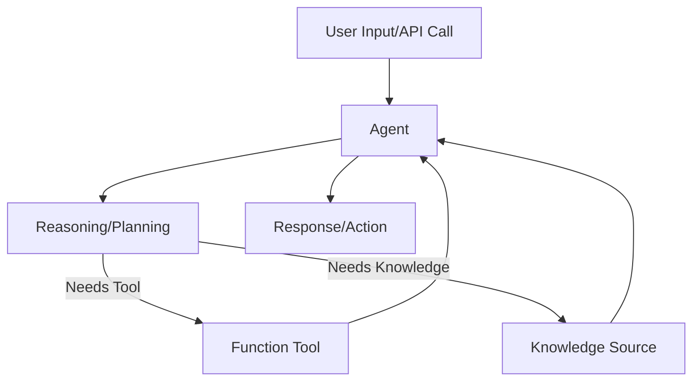

# OpenAI Agents SDK (Python) — Framework Blueprint Guide

This blueprint provides a comprehensive, modular, and actionable guide for building robust agents with the OpenAI Agents SDK in Python. It is designed for both new and experienced teams to ensure best practices, maintainability, and extensibility.

---

## 1. Framework Overview
OpenAI Agents SDK enables the creation of reasoning-capable, tool-augmented AI agents. Agents can:
- Receive user/system input
- Reason and plan actions
- Call Python functions ("tools") or external APIs
- Retrieve and synthesize knowledge from various sources
- Integrate with external systems (APIs, UI, automation platforms)

---

## 2. Core Concepts
| Concept         | Description                                                                 |
|-----------------|-----------------------------------------------------------------------------|
| Agent           | Central orchestrator: receives input, reasons, calls tools, returns output   |
| Function Tool   | Python function or API endpoint the agent can call to perform an action      |
| Knowledge      | Internal or external data sources (files, DB, embeddings, APIs, etc.)        |
| Flow            | The agent's process: input → reasoning → tool/knowledge → output            |
| Integration     | Connection to external systems (API, UI, workflow automation, etc.)          |

---

## 3. Project Structure Example
```plaintext
openai-agents-sdk-python/openai-agents-python/src/agents/
├── agent.py          # Agent definition
├── tool.py           # Function tool definitions
├── knowledge.py      # Knowledge source connectors/loaders
├── _config.py        # Prompts, tool registration, flow config
├── api.py            # API or UI integration
├── requirements.txt  # Dependencies
└── ...
```

---

## 4. Agent Lifecycle & Data Flow

**Checklist:**
- [ ] Input validation
- [ ] Reasoning (prompt, intent, context)
- [ ] Tool/knowledge invocation
- [ ] Output formatting
- [ ] Logging & error handling

**Refer to:**
- `openai-agents-sdk-python/openai-agents-python/src/agents/agent.py` for agent lifecycle implementation.
- `openai-agents-sdk-python/openai-agents-python/src/agents/tool.py` for tool invocation logic.
- `openai-agents-sdk-python/openai-agents-python/src/agents/knowledge.py` for knowledge source integration.
- **Documentation:** `openai-agents-sdk-python/openai-agents-python/docs/agents.md` for agent lifecycle details.

---

## 5. Defining and Registering Function Tools
- Each tool is a Python function with explicit type hints for input/output.
- Register tools with the agent using the SDK:
```python
def search_docs(query: str) -> str:
    ...
agent.register_tool(search_docs)
```
- Tools may be local functions, wrappers for external APIs, or workflow orchestrators.
- **Best Practice:** Keep tools atomic, stateless, and well-documented.

**Refer to:**
- `openai-agents-sdk-python/openai-agents-python/src/agents/tool.py` for examples of function tool definitions.
- **Documentation:** `openai-agents-sdk-python/openai-agents-python/docs/tools.md` for detailed tool registration.

---

## 6. Knowledge Source Integration
- Use SDK-provided or custom loaders for files, databases, embeddings, APIs, or vector stores.
```python
from openai_agents_sdk.knowledge import FileKnowledge
file_knowledge = FileKnowledge(path="docs/")
agent.add_knowledge(file_knowledge)
```
- **Blueprint:**
    - [ ] Choose appropriate knowledge connectors
    - [ ] Implement caching if necessary
    - [ ] Secure sensitive data access

**Refer to:**
- `openai-agents-sdk-python/openai-agents-python/src/agents/knowledge.py` for integrating knowledge sources.
- **Documentation:** `openai-agents-sdk-python/openai-agents-python/docs/context.md` for context and knowledge integration.

---

## 7. External System Integration
- Expose the agent via API (REST, GraphQL), CLI, web, or workflow automation tools (Zapier, Slack, etc.)
- Example (FastAPI):
```python
from fastapi import FastAPI
app = FastAPI()
@app.post("/ask")
async def ask_agent(query: str):
    return agent.run(query)
```
- **Checklist:**
    - [ ] Secure endpoints (API keys, OAuth, etc.)
    - [ ] Validate and sanitize all inputs
    - [ ] Monitor usage and performance

**Refer to:**
- `openai-agents-sdk-python/openai-agents-python/src/agents/api.py` for API integration examples.
- **Documentation:** `openai-agents-sdk-python/openai-agents-python/docs/running_agents.md` for running agents with external systems.

---

## 8. Error Handling, Logging, Security, and Compliance
- Use Python logging or integrate with tools like Sentry or Prometheus
- Handle exceptions at tool, knowledge, and agent flow levels
- **Security:**
    - Never log sensitive data
    - Implement authentication and authorization
    - Enforce role-based access where needed
- **Compliance:**
    - Adhere to AI ethics and legal requirements
    - Provide disclaimers and user warnings as appropriate

**Refer to:**
- `openai-agents-sdk-python/openai-agents-python/src/agents/_config.py` for logging and security configurations.
- **Documentation:** `openai-agents-sdk-python/openai-agents-python/docs/guardrails.md` for security and compliance guardrails.

---

## 9. Extensibility & Customization
- Dynamically register tools and knowledge sources
- Configure prompts, flow, and rules via YAML/JSON config
- Add middleware for logging, monitoring, or feedback
- Combine with other AI frameworks (e.g., LangChain, LlamaIndex) if needed
- **Blueprint:**
    - [ ] Modularize all components
    - [ ] Document extension points
    - [ ] Provide hooks for custom logic

**Refer to:**
- `openai-agents-sdk-python/openai-agents-python/src/agents/_config.py` for extensibility and customization options.
- **Documentation:** `openai-agents-sdk-python/openai-agents-python/docs/config.md` for configuration and customization.

---

## 10. Best Practices & Anti-Patterns
**Best Practices:**
- Define tools with clear, validated input/output
- Write thorough tests for tools and agent flows
- Separate agent logic, tool logic, knowledge connectors, and integrations
- Log all actions, errors, and user feedback (without exposing sensitive data)
- Regularly review and update prompts and tool registry

**Anti-Patterns:**
- Overloading tools with multiple responsibilities
- Hardcoding configuration or secrets
- Skipping input validation
- Logging sensitive or personal data
- Mixing agent, tool, and integration logic in the same module

**Refer to:**
- `openai-agents-sdk-python/openai-agents-python/src/agents/requirements.txt` for dependency management.
- **Documentation:** `openai-agents-sdk-python/openai-agents-python/docs/examples.md` for examples of best practices.

---

## 11. References & Further Reading
- `openai-agents-sdk-python/openai-agents-python/docs/index.md` for an overview of the documentation.
- `openai-agents-sdk-python/openai-agents-python/docs/quickstart.md` for a quick start guide.
- `openai-agents-sdk-python/openai-agents-python/docs/multi_agent.md` for multi-agent system details.
- `openai-agents-sdk-python/openai-agents-python/docs/visualization.md` for visualization techniques.

---

> Always consult the latest official documentation and sample projects. Use this blueprint to guide both initial setup and ongoing development of OpenAI Agents SDK-based projects.

